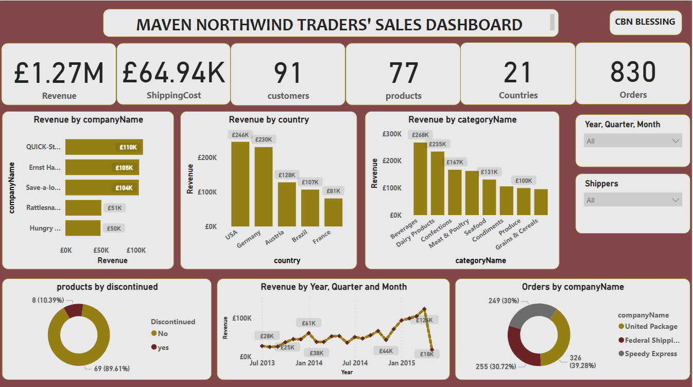

# MAVEN-NORTHWIND-TRADERS-SALES-PERFORMANCE
This is a project that shows my ability to visualize data from Maven Northwind Traders' Database using Power BI

## Introduction
 
The Maven Northwind Traders' is a global import and export company that specialises in supplying high quality gourmet food products to restaurants, cafes, and specialty retailers around the world.

This is a dataset for sales and order of Northwind Traders, including information on customers, products, orders, shippers and employees. The purpose of this project is to ascertain the performance of the company within the time interval, in terms of sales, products performance, key customers and the expenses done on shipping. 

### Data source

I imported the dataset from Maven Analytics website. The dataset is a CSV file type with 7 different CSV files.

### Data modelling

During visualization, i noticed that the tables weren't fully interactive. I had to remodel the dataset and manage the relationships between the tables to achieve the required model for optimal insight.

### Data cleaning

I applied the ETL technique to prepare the data for visualisation. The dataset was properly cleaned, transformed in the Power Query. I generated a new column for Revenue by multiplying unitPrice, quantity and the discount. I also added a new column for discontinued products, and i used the 'If statement' to categorize them. I loaded the modified dataset into the Power BI desktop for visualisation. 

### Objective

To ascertain the company's  performance in the following key areas;

Sales trends
Product performance 
Key customers 
Shipping costs,

I came up with this KPI dashboard to address the company's concerns, hence providing valid insight on their sales performance. 

### Visual representation
 
I created measures using DAX expressions for Revenue, Shipping Costs, total customers, number of orders, total products, and the total number of countries where the orders were made from.

### Insights

Between 2013 and 2015, a total revenue of £1.27M was made from 830 orders, with a total shipping Cost of £64.94k.

From the report, all the revenue came from 91 distinct customers resident in 21 different countries. At the moment, the company has a total of 77 products of which 8 has been discontinued. 

The highest revenue was generated from Quick-stop company and the country that gave the highest revenue is USA. Beverages had the highest purchase with a total revenue of £268k. Out of the 77 products, 8 of them have been discontinued due to low patronage and high cost of production.

Between 2013 and April 2015, there was an approximately upward trajectory in sales, and the highest revenue was recorded in April of 2015.

Based on the representation, 3 major shipping companies were contracted for all the orders, and United package shipping company was frequently used because of their service quality, lower cost of shipping and prompt delivery.

### Recommendation
 
Considering the amount spent on shipping, sourcing for a more affordable and efficient alternative shipping company can reduce amount spent on logistics, hence, increasing the Revenue generated. 

Beverages and diary products should be invested on more as they have higher propensity to generate sales. 

Customers from USA and Germany should be given more priority as their high rate of demand shows how reliant they are on the products.

